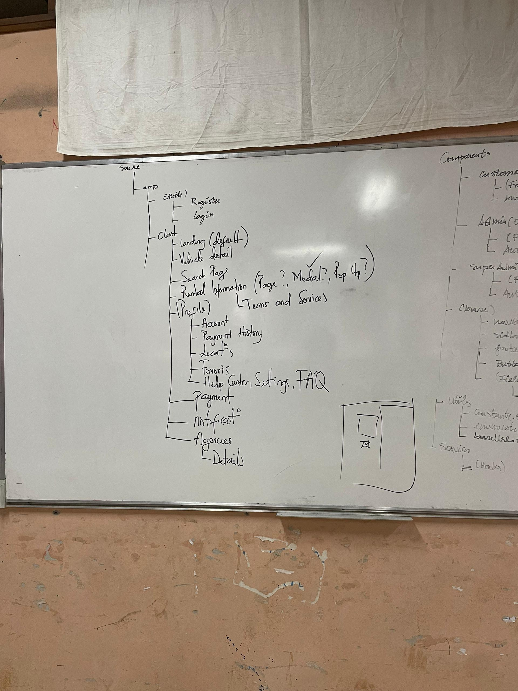
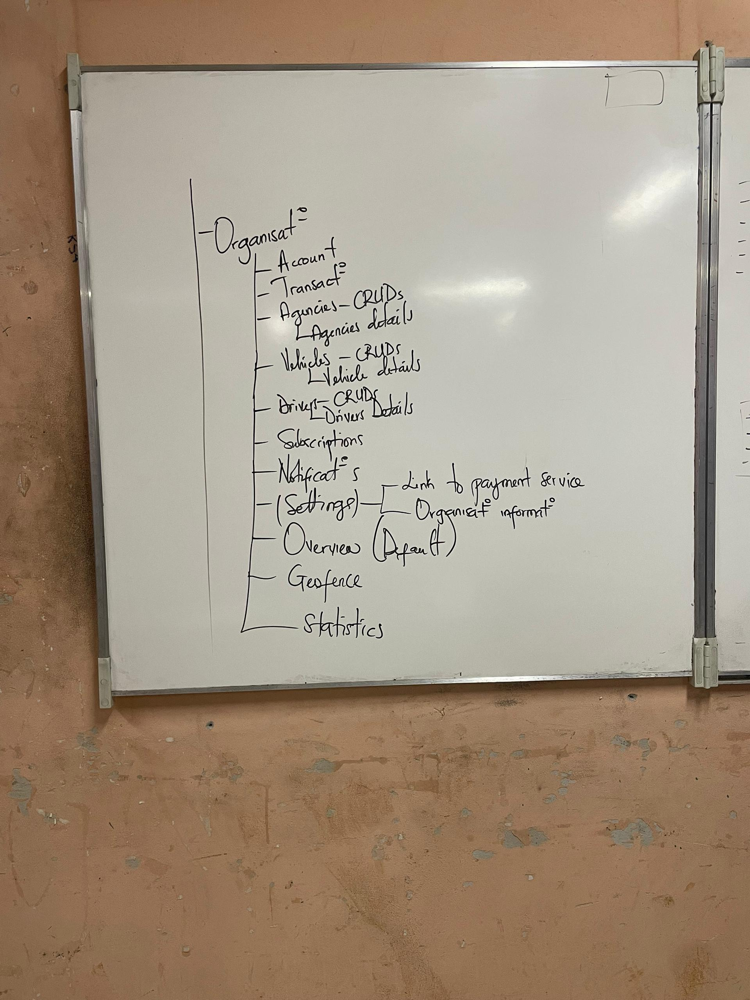
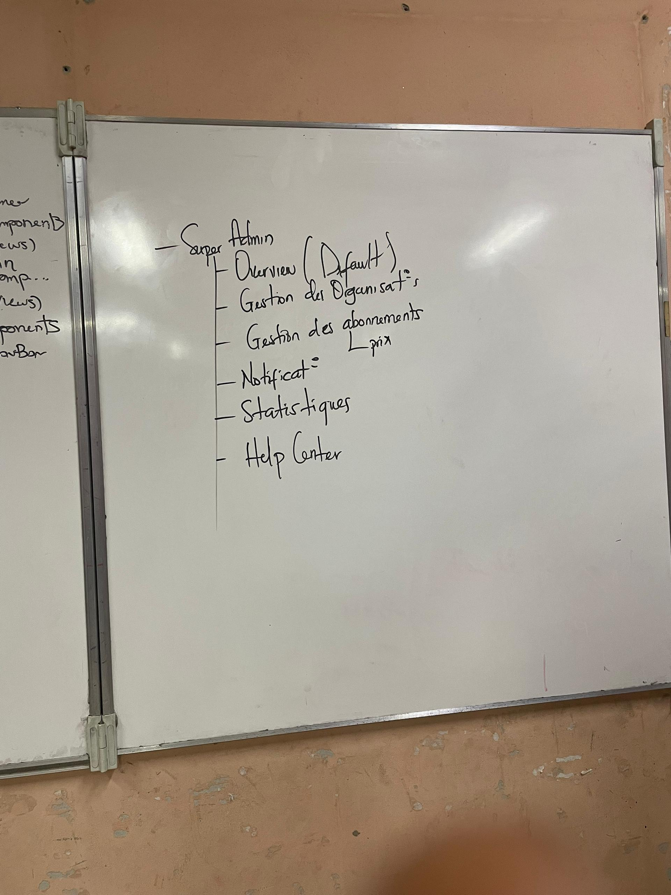
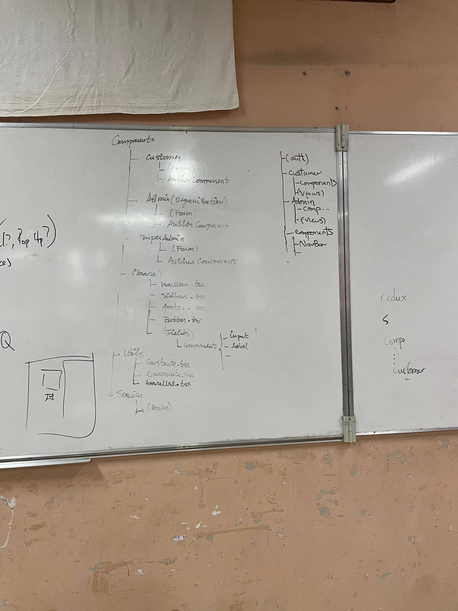

# Project Name

## Overview
This project is a structured web application built using **Next.js**, **TypeScript**, and **Tailwind CSS**. It follows the app routing pattern and incorporates Docker for containerized deployment.

### Features
- **Next.js App Router**: Utilizes the latest routing structure for cleaner and more maintainable code.
- **TypeScript**: Ensures type safety and robust code quality.
- **Tailwind CSS**: Provides utility-first CSS for faster styling.
- **Docker**: Enables easy deployment and environment consistency.

## Project Structure
The project follows a well-defined structure outlined on whiteboards for all team members to adhere to. This includes clear separation for clients, admins, and super-admins, each with designated functionalities.

### Key Sections
1. **Client**
   - Landing page (default)
   - Vehicle details
   - Search page
   - Profile management (accounts, payment history, etc.)
   - Help center, settings, and FAQ

<div align="center">
  
</div>

2. **Organisation**
   - Account and transaction management
   - Agency CRUD operations and details
   - Vehicle CRUD operations and details
   - Driver management
   - Geofencing and statistics overview

<div align="center">
  
</div>

3. **Super Admin**
   - Organisation management
   - Subscription management
   - Notifications
   - Statistics
   - Help center

<div align="center">
  
</div>

3. **Components**

<div align="center">
  
</div>

## Installation and Setup

### Prerequisites
Ensure you have **Docker** and **Docker Compose** installed on your machine.

### Steps to Run the Project
1. Clone the repository:
   ```bash
   git clone https://github.com/AdministrationReseau/easy-rental
   ```
2. Navigate into the project directory:
   ```bash
   cd easy-rental
   ```
3. Build and launch the project using Docker Compose:
   ```bash
   docker-compose up --build
   ```

### Development
To start the development server locally, run:
```bash
npm install
npm run dev
```

## Usage
Visit `http://localhost:3000` (or the configured port) to see the application in action. The app includes client-side and server-side rendering for better performance and SEO.

## Tech Stack
- **Next.js**: React framework for building modern web applications.
- **TypeScript**: Superset of JavaScript providing static typing.
- **Tailwind CSS**: Utility-first CSS framework for rapid UI development.
- **Docker**: Containerization tool for consistent deployment environments.

## Contributing
Please ensure all new features and modifications are in line with the project's architecture and follow best practices for Next.js, TypeScript, and Tailwind.

## License
This project is licensed under the [MIT License](LICENSE).
