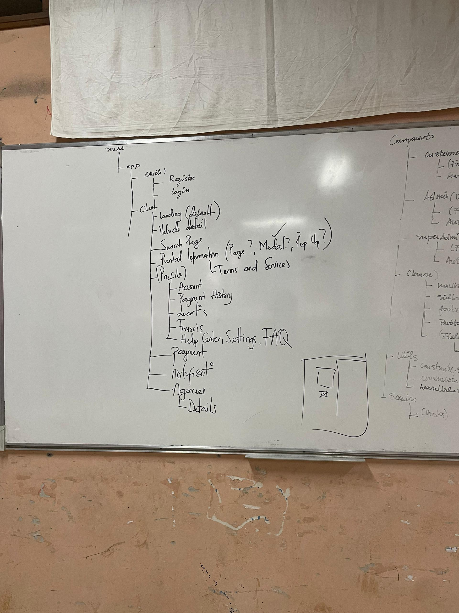
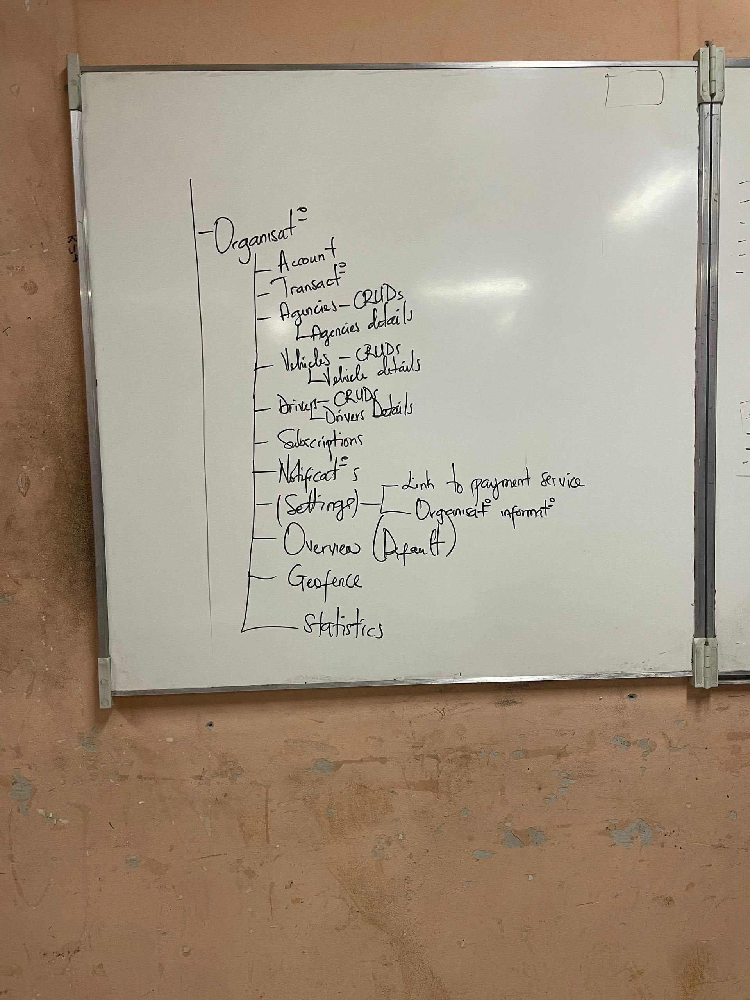
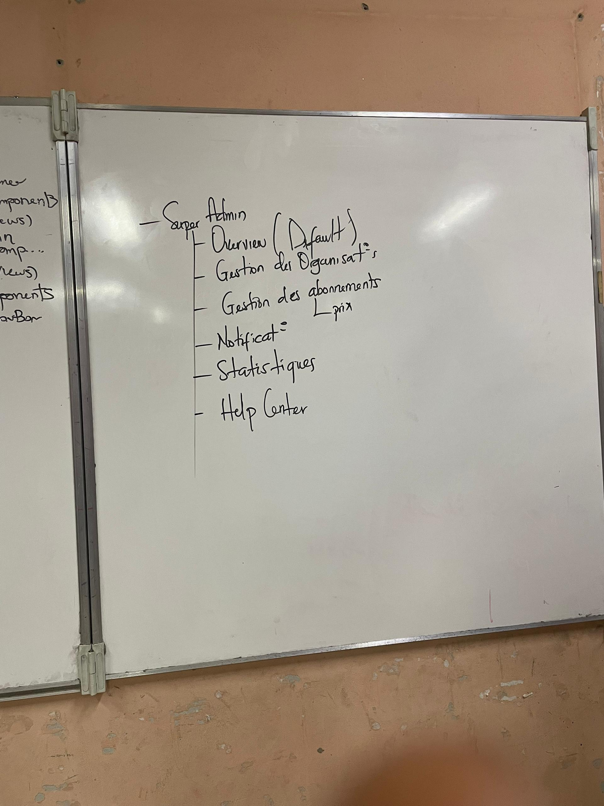
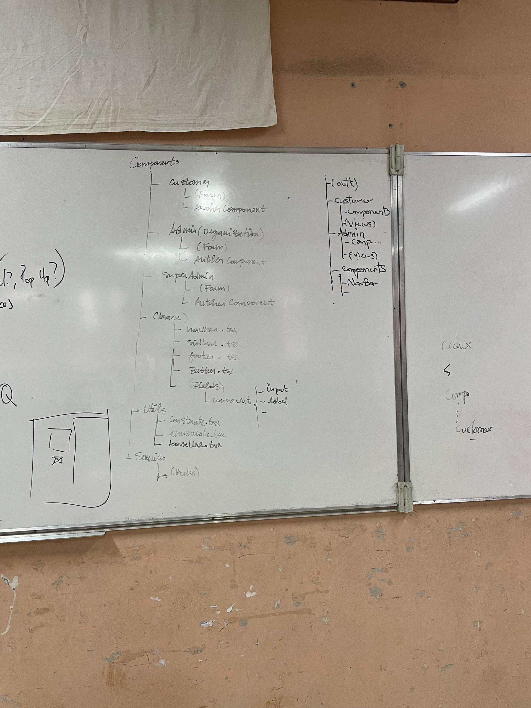

# Easy Rental - Car Rental Platform

## Overview
Easy Rental is a car rental platform designed to streamline the vehicle rental process for clients, organizations, and administrators. It is a structured web application built using **Next.js**, **TypeScript**, and **Tailwind CSS**. It follows the Next.js App Router pattern and incorporates Docker for containerized deployment.

### User Roles
The platform supports three main user roles:
- **Client**: Individuals who can browse available vehicles, make reservations, and manage their bookings.
- **Organisation**: Entities (e.g., rental businesses) that can manage a fleet of vehicles, oversee rentals, and track earnings.
- **Super Admin**: Administrators with overall control of the platform, including user management, system settings, and monitoring platform activity.

### Features
- **Next.js App Router**: Utilizes the latest routing structure for cleaner and more maintainable code.
- **TypeScript**: Ensures type safety and robust code quality.
- **Tailwind CSS**: Provides utility-first CSS for faster styling.
- **Docker**: Enables easy deployment and environment consistency.

## Project Structure
The project follows a modular and well-organized architecture to ensure maintainability and scalability. The structure is designed to separate concerns and provide a clear overview of the different parts of the application.

The project is built using Next.js and its App Router, meaning the primary application code is typically located within the `app` directory at the root of the project. While some projects use an additional `src` directory, this project places core application logic directly in `app`.

### Key Directories and Files:

- **`app/`**: This is the core directory for a Next.js application using the App Router. Each folder inside `app/` typically represents a route segment. For example, `app/dashboard/settings/page.tsx` would correspond to the `/dashboard/settings` URL.
    - **`app/layout.tsx`**: Defines the root layout for the application. This component is shared across all pages.
    - **`app/page.tsx`**: Represents the home page of the application (corresponding to the `/` route).
    - **`app/(auth)/`**: This is an example of a route group. Folders in parentheses are ignored for routing purposes, allowing for organization of routes (e.g., all authentication-related pages like login and register can be grouped here).
    - **`app/assets/`**: Contains static assets like images, fonts, etc., that are used within the application. The `public/` directory at the root is also used for static assets that are directly accessible via URL.
    - **`app/components/`**: This directory (or a top-level `components/` or `src/components/` directory) typically holds reusable UI components (e.g., `Header.tsx`, `Footer.tsx`, `Button.tsx`).
    - **`app/styles/`**: Contains global styles or styles related to specific sections of the application (e.g., `globals.css`).
    - **`app/utils/`**: (or `src/utils/`) A common place for utility functions, helper scripts, or API interaction modules (e.g., `api.ts`).

- **`public/`**: This directory is used to serve static assets directly from the root of the application. Files in `public/` can be accessed via a base URL (e.g., `public/logo.png` would be accessible at `http://yourdomain.com/logo.png`). The images used in this README for `Customer.jpeg`, `Organisation.jpeg`, etc. are good examples.

- **`next.config.js`** or **`next.config.mjs`**: (or `.ts`) The configuration file for Next.js. It allows customization of various Next.js features, such as environment variables, redirects, rewrites, and build process optimizations.

- **`tailwind.config.ts`** (or `.js`): The configuration file for Tailwind CSS. Here, you can customize your design tokens (colors, spacing, fonts), add plugins, and configure how Tailwind processes your CSS.

- **`tsconfig.json`**: The configuration file for TypeScript. It specifies the root files and the compiler options required to compile the project.

- **`package.json`**: Lists the project dependencies, scripts (e.g., `dev`, `build`, `start`), and other metadata for the Node.js package manager (npm or yarn).

- **`docker-compose.yml`**: Defines the services, networks, and volumes for a Docker application. In this project, it's used to set up the Next.js application environment in a container.

- **`Dockerfile`**: Contains instructions to build a Docker image for the application. This typically includes setting up the Node.js environment, copying application files, installing dependencies, and specifying the command to run the application.

The project structure is designed to provide clear separation for different user roles (Clients, Organisations, and Super Admins), each with designated functionalities and UI components, often reflected in the routing structure within the `app/` directory. The images below illustrate the general interface for each main user section.

### Visual Overview of User Sections
1. **Client Interface**

[//]: # (```)

[//]: # (cusomer)

[//]: # (└──app/)

[//]: # (    ├── &#40;auth&#41;)

[//]: # (    │   ├── Register.tsx)

[//]: # (    │   └── Login.tsx)

[//]: # (    ├── assets/)

[//]: # (    │   └── readme/)

[//]: # (    │       └── Customer.jpeg)

[//]: # (    ├── components/)

[//]: # (    │   ├── Header.tsx)

[//]: # (    │   └── Footer.tsx)

[//]: # (    ├── pages/)

[//]: # (    │   ├── index.tsx)

[//]: # (    │   └── about.tsx)

[//]: # (    ├── styles/)

[//]: # (    │   └── globals.css)

[//]: # (    └── utils/)

[//]: # (        └── api.ts)

[//]: # ()
[//]: # (```)

<div align="center">
  
</div>

2. **Organisation Interface**
<div align="center">
  
</div>

3. **Super Admin Interface**

<div align="center">
  
</div>

<!--
The "Components" image below seems to illustrate a general UI component structure rather than a user section.
It can be re-evaluated if it adds specific clarity to this section or moved to a more relevant part if needed.
For now, the three user interfaces provide a good visual overview.

<div align="center">
  
</div>
-->

## Installation and Setup

### Prerequisites
Ensure you have **Docker** and **Docker Compose** installed on your machine.

### Steps to Run the Project
1. Clone the repository:
   ```bash
   git clone https://github.com/AdministrationReseau/easy-rental
   ```
2. Navigate into the project directory:
   ```bash
   cd easy-rental
   ```
3. Build and launch the project using Docker Compose:
   ```bash
   docker-compose up
   ```

### Development
To start the development server locally (without Docker), ensure you have Node.js and npm installed, then run:
```bash
npm install
npm run dev
```
The application will typically be available at `http://localhost:3000`.

## Usage
After starting the application (either via Docker or the local development server using `npm run dev`), you can access it by visiting `http://localhost:3000` (or the port specified in your Docker configuration or the `npm run dev` output).

The application's functionality varies based on user roles:

### Navigating the Application:

1.  **Home Page**: The initial page you land on. It typically showcases available vehicles and provides options to search or filter them.
2.  **Authentication**:
    *   **Sign Up/Register**: New users (Clients or Organisation representatives) can create an account. This typically involves providing details like name, email, and password.
    *   **Login**: Existing users can log in with their credentials. The application will then direct them to their respective dashboards or role-specific views.
3.  **Client Dashboard/Features**:
    *   **Browse Vehicles**: View a catalog of available cars with details like make, model, pricing, and availability.
    *   **Search and Filter**: Utilize search bars and filters (e.g., by car type, rental dates, price range) to find suitable vehicles.
    *   **Make a Reservation**: Select a vehicle, choose rental dates, provide necessary information, and confirm the booking.
    *   **View My Bookings**: Access a list of current and past reservations.
    *   **Manage Profile**: Update personal information, contact details, and potentially payment methods.
4.  **Organisation Dashboard/Features**:
    *   **Manage Vehicle Fleet**: Add new vehicles to the platform, update details of existing vehicles (e.g., availability, pricing, specifications), and remove vehicles from the fleet.
    *   **Oversee Rentals**: Track ongoing and completed rentals for their vehicles.
    *   **View Earnings/Reports**: Access financial reports and analytics related to their vehicle rentals.
    *   **Manage Organisation Profile**: Update business details, contact information, and operational settings.
5.  **Super Admin Dashboard/Features**:
    *   **User Management**: View, create, edit, suspend, or delete user accounts (Clients, Organisations).
    *   **Platform Configuration**: Manage global settings for the application (e.g., default rental policies, commission rates, categories, terms of service).
    *   **System Monitoring & Analytics**: Oversee platform activity, view system logs, gather usage statistics, and manage the overall health of the application.
    *   **Content Management**: Manage site-wide informational content if applicable (e.g., FAQs, announcements).

### General Application Features:

*   **Responsive Design**: The application is designed to be accessible and usable on various screen sizes, including desktops, tablets, and mobile devices.
*   **Modern User Interface**: Built with Tailwind CSS for a clean, utility-first design, aiming for an intuitive and pleasant user experience.

The application leverages Next.js for both client-side and server-side rendering, contributing to better performance and SEO. As you navigate, observe how the URL structure corresponds to the Next.js App Router organization detailed in the "Project Structure" section.

## Docker
This project uses Docker for containerization, ensuring a consistent development and deployment environment. The `Dockerfile` and `docker-compose.yml` files are configured to build and run the application.

For detailed instructions on Docker-specific commands, building images, running containers, and troubleshooting, please refer to the dedicated [README.Docker.md](README.Docker.md) file.

## Tech Stack
The core technologies used in this project include:
- **Next.js**: A React framework for building performant, server-rendered web applications with a great developer experience.
- **TypeScript**: A superset of JavaScript that adds static typing, improving code quality and maintainability.
- **Tailwind CSS**: A utility-first CSS framework for rapidly building custom user interfaces.
- **Docker**: A platform for developing, shipping, and running applications in containers, ensuring consistency across environments.

## Contributing
We welcome contributions to improve and expand this platform! Whether you're fixing a bug, proposing a new feature, or enhancing documentation, your help is appreciated. Please ensure all new features and modifications align with the project's architecture and adhere to best practices for Next.js, TypeScript, and Tailwind CSS.

To contribute, please follow these guidelines:

### Reporting Bugs
If you encounter a bug, please help us by reporting it. To file a bug report:
1.  **Check Existing Issues**: Before creating a new issue, please check if the bug has already been reported.
2.  **Provide Details**: Open an issue on GitHub. Include the following details:
    *   A clear and descriptive title.
    *   Steps to reproduce the bug.
    *   What you expected to happen.
    *   What actually happened (including any error messages or screenshots).
    *   Your environment details (e.g., browser, operating system).

### Suggesting Features
We are open to new ideas and feature suggestions. To suggest a feature:
1.  **Check Existing Suggestions**: See if the feature has already been suggested or discussed in the issues.
2.  **Provide a Clear Description**: Open an issue on GitHub. Describe the feature you'd like to see, why it would be beneficial, and any potential implementation ideas.

### Submitting Pull Requests
If you'd like to contribute code to the project:
1.  **Fork the Repository**: Create your own fork of the `easy-rental` repository.
2.  **Create a Branch**: Create a new branch in your fork for your feature or bug fix. Use a descriptive branch name (e.g., `feat/add-payment-gateway` or `fix/login-error`).
    ```bash
    git checkout -b your-branch-name
    ```
3.  **Make Your Changes**: Implement your feature or bug fix.
    *   Follow the project's coding style and conventions.
    *   Ensure your code is well-commented, especially in complex areas.
    *   Write or update tests for your changes, if applicable.
4.  **Test Your Changes**: Ensure that all tests pass and that your changes do not introduce new issues.
    ```bash
    npm run test # Ensure this is the correct test command for the project
    ```
5.  **Commit Your Changes**: Use clear, descriptive, and conventional commit messages.
    ```bash
    git commit -m "feat: Implement X feature" -m "Detailed description of changes, including motivation and approach."
    ```
6.  **Push to Your Fork**: Push your changes to your forked repository.
    ```bash
    git push origin your-branch-name
    ```
7.  **Open a Pull Request (PR)**: Navigate to the original `easy-rental` repository on GitHub and open a pull request from your branch to the project's `main` (or `develop`) branch.
    *   Provide a clear title and a comprehensive description for your PR, explaining the changes made and their purpose.
    *   Reference any related GitHub issues (e.g., "Fixes #123", "Closes #456").
8.  **Code Review**: Your PR will be reviewed by project maintainers. Engage in the discussion, and be prepared to make further adjustments based on feedback.

### Code of Conduct
All contributors are expected to adhere to the project's Code of Conduct. Please ensure you are familiar with its terms. (If a `CODE_OF_CONDUCT.md` file exists, link to it here. Otherwise, this statement can serve as a basic expectation, or you might consider adding one.)

Thank you for considering contributing to Easy Rental!

## License
This project is licensed under the MIT License. See the [LICENSE](LICENSE) file for full details.
